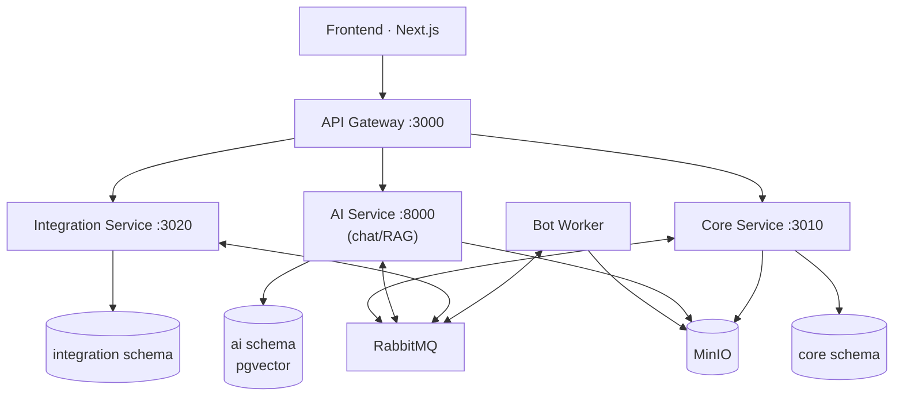

# MeetingMind — Kiến trúc hệ thống (MVP)

Tài liệu này mô tả cách các service phối hợp, ai được ghi dữ liệu nào, và luồng xử lý một cuộc họp từ lúc tạo đến lúc đồng bộ ra công cụ ngoài.

Đọc kèm: [DATABASE_DESIGN.md](DATABASE_DESIGN.md) cho chi tiết bảng và cột.

## 1. Các thành phần

| Thư mục | Công nghệ | Trách nhiệm | Trạng thái |
| --- | --- | --- | --- |
| `frontend/` | Next.js | UI, realtime, ghi âm phía trình duyệt | Chưa tạo |
| `api-gateway/` | NestJS | Cổng vào duy nhất: xác thực token, định tuyến, rate limit, WebSocket | Đang là template |
| `core-service/` | NestJS | Nghiệp vụ và điều phối: workspace, project, meeting, transcript, minutes, task, review, job | 34 module CRUD đã dựng |
| `integration-service/` | NestJS | Kết nối ngoài: Calendar, Jira/Trello, export tài liệu, webhook | Đang là template |
| `ai-service/` | FastAPI | STT, tóm tắt, trích xuất công việc, RAG | Đang là template |
| `bot-worker/` | Python + Playwright | Vào phòng họp trực tuyến, ghi âm, upload | Thư mục rỗng |
| `contracts/` | JSON Schema | Định nghĩa chung cho API và event giữa các service | Chưa tạo |
| `infrastructure/` | Docker Compose | Postgres, RabbitMQ, Redis, MinIO, monitoring | Đã bị `docker-compose.yml` ở root thay thế |

Đây là **5 backend triển khai độc lập + 1 frontend**. `core-service` là một backend chia module bên trong, không phải monolith của cả hệ thống.

## 2. Sơ đồ

Mũi tên tới RabbitMQ là gửi **và** nhận; không phải service nào cũng nhận mọi message.

## 3. Nguyên tắc kiến trúc

### 3.1. Cổng vào duy nhất

Chỉ `api-gateway` được expose ra ngoài. `core-service`, `integration-service`, `ai-service` chỉ nghe trong mạng nội bộ.

> Hiện `docker-compose.yml` vẫn publish cổng 3010/3020/8000 ra host. Đây là **ngoại lệ dev** để gọi Swagger trực tiếp, phải bỏ khi triển khai thật.

Gateway chịu trách nhiệm: kiểm tra token, rate limit, định tuyến, đẩy thông báo realtime. **Không** chứa logic phân quyền nghiệp vụ — việc đó thuộc Core.

### 3.2. Mỗi bảng có đúng một service sở hữu

- Service sở hữu là service duy nhất được **ghi** vào bảng đó.
- Service khác lấy dữ liệu qua API hoặc nhận event, không truy vấn trực tiếp.
- Foreign key chỉ dùng **trong phạm vi schema của một service**.
- ID trỏ sang service khác là tham chiếu logic, không khai báo FK.

Ví dụ: `external_task_links.actionItemId` nằm ở Integration nên không có FK sang Core. Ngược lại `action_item_citations.transcriptSegmentId` có FK vì cùng thuộc Core.

### 3.3. Tách schema database

MVP dùng **một PostgreSQL instance, ba schema, ba tài khoản**:

| Service | Schema | Tài khoản |
| --- | --- | --- |
| core-service, api-gateway | `core` | `mm_core` |
| integration-service | `integration` | `mm_integration` |
| ai-service | `ai` | `mm_ai` |

Mỗi service tự quản migration của mình. Cờ `SQL_SYNCHRONIZE` quyết định service nào được sinh bảng — chỉ bật ở đúng một service mỗi schema, và phải tắt hẳn khi có migration thật.

> Đã triển khai. Trước đó cả 4 service dùng chung `meetingmind` + schema `public` + user `mmuser`: `ai-service` đã chiếm mất tên bảng `users` bằng Alembic, và ba service NestJS cùng chạy `ALTER TABLE` lúc khởi động.

Image Postgres phải là bản có pgvector (`pgvector/pgvector:pg15`), không dùng `postgres:15-alpine`.

### 3.4. Core là bên điều phối

Bot và AI **không tự sửa** bảng nghiệp vụ. Chúng nhận lệnh, làm việc, rồi báo kết quả bằng event. Core quyết định kết quả đó có được ghi thành dữ liệu chính thức hay không.

Hệ quả: `bot_sessions`, `processing_jobs`, `files` thuộc Core, không thuộc bot-worker/ai-service.

### 3.5. Message chỉ mang tham chiếu

RabbitMQ truyền ID, số phiên bản và object key. Không đưa audio hoặc toàn bộ transcript vào message.

### 3.6. Outbox và idempotency

Mỗi service ghi `outbox_events` trong **cùng transaction** với thay đổi nghiệp vụ, rồi publisher đẩy ra RabbitMQ. Bên nhận ghi `processed_messages` để chống xử lý lặp.

Mọi job (`processing_jobs`, `sync_jobs`) có `idempotencyKey` và unique constraint trên khóa đó.

## 4. Hợp đồng sự kiện

Đặt trong `contracts/` dưới dạng JSON Schema để cả TypeScript và Python dùng chung.

Mọi event đều có phần đầu chung: `eventId`, `eventType`, `eventVersion`, `occurredAt`, `workspaceId`, `correlationId`.

| Event | Publisher | Consumer | Payload chính |
| --- | --- | --- | --- |
| `bot.join.requested` | Core | Bot | `botSessionId`, `meetingId`, `joinUrl` |
| `bot.status.changed` | Bot | Core | `botSessionId`, `status`, `error?` |
| `recording.completed` | Bot | Core | `botSessionId`, `objectKey[]`, `durationMs` |
| `transcription.requested` | Core | AI | `jobId`, `meetingId`, `fileId`, `objectKey`, `language` |
| `transcription.completed` | AI | Core | `jobId`, `runId`, `segments[]` hoặc `resultObjectKey` |
| `analysis.requested` | Core | AI | `jobId`, `meetingId`, `transcriptVersionId` |
| `analysis.completed` | AI | Core | `jobId`, `runId`, `minutesDraft`, `proposedItems[]` |
| `index.requested` | Core | AI | `sourceType`, `sourceId`, `sourceVersion` |
| `permission.changed` | Core | AI | `scopeType`, `scopeId` — để cập nhật lại ACL của chunk |
| `source.deleted` | Core | AI | `sourceType`, `sourceId` — để xóa chunk |
| `task.sync.requested` | Core | Integration | `actionItemId`, `integrationId`, `idempotencyKey` |
| `task.sync.completed` | Integration | Core | `actionItemId`, `externalKey`, `status`, `error?` |

Job thất bại được retry có giới hạn rồi chuyển vào dead-letter queue, không im lặng bỏ qua.

## 5. Luồng xử lý một cuộc họp

| Bước | Ai làm | Việc |
| --- | --- | --- |
| 1 | Core | Tạo meeting, lưu lịch chạy |
| 2 | Scheduler (Core) | Đến giờ thì tạo `bot_session`, phát `bot.join.requested` |
| 3 | Bot | Vào phòng, báo `waiting_admission` → `recording` |
| 4 | Bot | Upload audio lên MinIO, phát `recording.completed` kèm object key |
| 5 | Core | Ghi `files`, tạo `processing_job`, phát `transcription.requested` |
| 6 | AI | Phiên âm, ghi `ai_runs`, phát `transcription.completed` |
| 7 | Core | Tạo `transcript_version` mới và các `transcript_segments`, phát `analysis.requested` |
| 8 | AI | Sinh tóm tắt + đề xuất công việc, phát `analysis.completed` |
| 9 | Core | Tạo `minutes_version` nháp và `review_batch` + `review_items` |
| 10 | Người dùng | Sửa, duyệt → Core sinh `action_items` chính thức |
| 11 | Core | Phát `task.sync.requested` khi cấu hình cho phép |
| 12 | Integration | Tạo/cập nhật issue ngoài, phát `task.sync.completed` |

Hai lưu ý:

- **`meeting.created` không đồng nghĩa bot phải vào ngay.** Scheduler phải bền vững: chịu được dời lịch, hủy lịch, và service khởi động lại.
- Luồng trên là xử lý **sau** ghi âm. Transcript realtime cần luồng khác (audio theo chunk, số thứ tự, transcript tạm) và chỉ chốt phiên bản chính thức lúc kết thúc. WebSocket ở gateway tự nó không tạo ra khả năng phiên âm realtime.

Với nguồn `upload`, luồng bắt đầu thẳng từ bước 5.

## 6. Phân quyền

Ba trục vai trò tách biệt, không gộp vào một cột `role`:

| Trục | Lưu ở | Giá trị |
| --- | --- | --- |
| Quyền hệ thống | `users.systemRole` | `SUPER_ADMIN`, `USER` |
| Quyền workspace | `workspace_members.role` | `OWNER`, `PM`, `MEMBER`, `VIEWER` |
| Quyền project | `project_members.role` | `PM`, `MEMBER`, `VIEWER` |
| Vai trò chuyên môn | `project_members.discipline` | `BACKEND`, `FRONTEND`, `QA`, `BA`, ... |
| Vai trò trong cuộc họp | `meeting_participants.role` | `host`, `secretary`, `presenter`, `approver`, `participant` |

Quy tắc bắt buộc:

- AI **không** được thay đổi bất kỳ trục nào. Gợi ý của AI luôn ở trạng thái chờ xác nhận.
- `SUPER_ADMIN` quản trị cấu hình **không** mặc nhiên đọc được nội dung cuộc họp riêng tư. Quyền đọc nội dung xét theo `meetings.visibility` + membership.
- RAG lọc quyền **trước** khi truy xuất, và kiểm tra lại quyền khi người dùng mở nguồn trích dẫn.

`BaseControllerFactory` mặc định đặt mọi route ở `roles: [SystemRole.ADMIN]`. Toàn bộ 18 module hiện đang để nguyên mặc định đó — phải thay bằng guard theo workspace trước khi dùng thật.

## 7. Quan trắc và vận hành

- Mỗi service expose `/metrics` cho Prometheus. Hiện container Prometheus chạy nhưng **không có file cấu hình scrape nào trong repo**.
- Log có `correlationId` xuyên suốt một cuộc họp để lần được cả chuỗi Core → Bot → AI → Integration.
- Giữ trạng thái từng bước trong `processing_jobs` để retry đúng bước lỗi, không chạy lại từ đầu.
- Không hiển thị "hoàn tất" khi transcript/AI chưa xong.

## 8. Phân kỳ

| Giai đoạn | Phạm vi |
| --- | --- |
| MVP | Tài khoản/workspace/project; họp trực tiếp và upload file; note gắn timestamp; STT sau họp; gán speaker thủ công; biên bản + task nháp; duyệt; Task Board; RAG có nguồn và lọc quyền |
| Tiếp theo | Bot cho một nền tảng; kết nối Calendar; đồng bộ một chiều Jira hoặc Trello; mẫu biên bản; nhắc việc; ghi âm khi mất mạng |
| Nâng cao | Nhận diện qua mẫu giọng; transcript realtime; họp kết hợp; ghi chú cộng tác; đồng bộ hai chiều; đánh giá tải công việc |

## 9. Việc còn lại

Đã xong: tách 3 schema + pgvector, bỏ MongoDB, 34 module core-service khớp thiết kế.

Còn lại, theo thứ tự ưu tiên:

1. **Phân quyền theo workspace** — thay mặc định `roles: [SystemRole.ADMIN]` của
   `BaseControllerFactory` bằng guard đọc `workspace_members`. Đây là việc chặn
   sử dụng thật, vì hiện mọi route đều đòi quyền Admin hệ thống.
2. **Migration thật** — sinh migration cho 34 module rồi tắt `SQL_SYNCHRONIZE`.
3. **Thư mục `contracts/`** — JSON Schema cho 12 event ở mục 4.
4. **Viết lại module `file`** — lưu object key MinIO thay vì base64 trong cột `data`.
5. **Cron dọn bảng `Auth`** — thay TTL index đã mất khi bỏ MongoDB.
6. **Cấu hình Prometheus** — hiện container chạy nhưng không có scrape target.
7. **Bỏ publish cổng 3010/3020/8000** khi triển khai thật.
8. **bot-worker và frontend** — hai thư mục còn rỗng.
